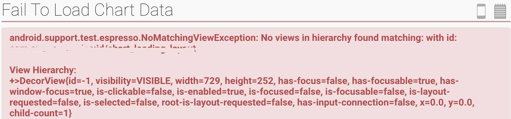
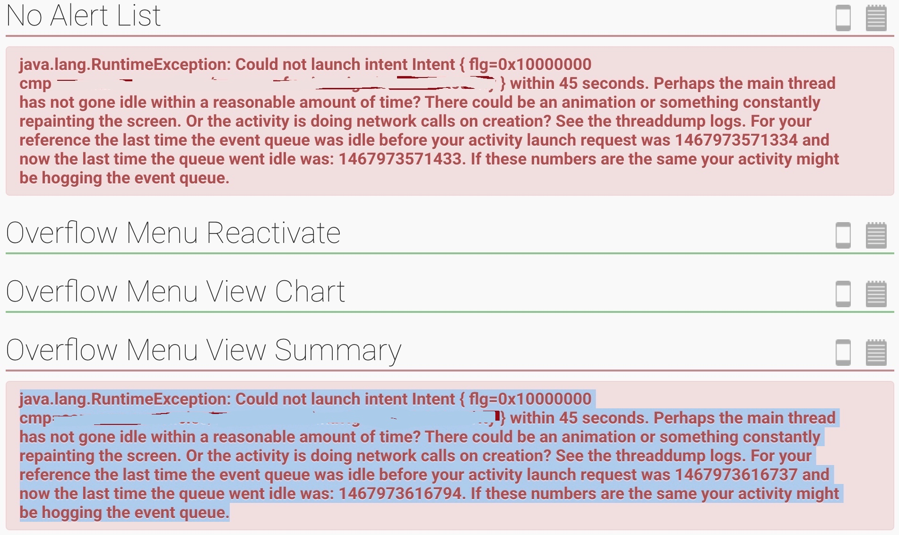
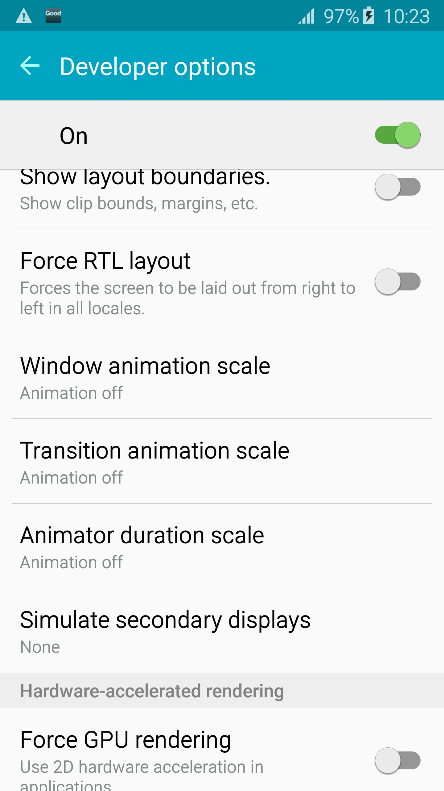

# Automation lesson and learn#

## Two main tricky issues##
These two issues below happens randomly on different devices/simulators. It can get passed on most of real devices above Android 4.3, but get random failure on some simulators or 4.3 devices.

`Solution will be given in the last section "Issue root cause analysis"`

* ***Fail to find view in hierarchy***

      

* ***Fail to start target activity***

  

## Some background knowledge of Android UI automation ##
It is highly recommended by Google to disable all animation on testing device before running UI automation to improve efficiency and avoid some tricky issue like "No view matched in view hierarchy".

***How to disable animation on testing device?***

* **Option 1**

  1. Go to device "Settings" -> "Developer options"
  2. turn off "Window animation scale", "Transition animation scale" and "Animator duration scale"
  
  

* **Option 2**

  Add rule to each test case, which disable animation before invoking``setUp()`` and recover animation after ``tearDown()`` of each test case.

  One way to do this is to create a custom rule as below:

  ```
  public class DisableAnimationsRule implements TestRule {
    private Method mSetAnimationScalesMethod;
    private Method mGetAnimationScalesMethod;
    private Object mWindowManagerObject;

    public DisableAnimationsRule() {
        try {
            Class<?> windowManagerStubClazz = Class.forName("android.view.IWindowManager$Stub");
            Method asInterface = windowManagerStubClazz.getDeclaredMethod("asInterface", IBinder.class);

            Class<?> serviceManagerClazz = Class.forName("android.os.ServiceManager");
            Method getService = serviceManagerClazz.getDeclaredMethod("getService", String.class);

            Class<?> windowManagerClazz = Class.forName("android.view.IWindowManager");

            mSetAnimationScalesMethod = windowManagerClazz.getDeclaredMethod("setAnimationScales", float[].class);
            mGetAnimationScalesMethod = windowManagerClazz.getDeclaredMethod("getAnimationScales");

            IBinder windowManagerBinder = (IBinder) getService.invoke(null, "window");
            mWindowManagerObject = asInterface.invoke(null, windowManagerBinder);
        } catch (Exception e) {
            throw new RuntimeException("Failed to access animation methods", e);
        }
    }

    @Override
    public Statement apply(final Statement statement, final Description description) {
        return new Statement() {
            @Override
            public void evaluate() throws Throwable {

                setAnimationScaleFactors(0.0f);
                try {
                statement.evaluate();

                } finally {
                    setAnimationScaleFactors(1.0f);
                }
            }
        };
    }

    private float[] getAnimationScaleFactors() throws Exception {
        float[] scaleFactors = (float[]) mGetAnimationScalesMethod.invoke(mWindowManagerObject);
        return scaleFactors;
    }

    private void setAnimationScaleFactors(float scaleFactor) throws Exception {
        float[] scaleFactors = (float[]) mGetAnimationScalesMethod.invoke(mWindowManagerObject);
        Arrays.fill(scaleFactors, scaleFactor);
        mSetAnimationScalesMethod.invoke(mWindowManagerObject, scaleFactors);
        Log.v("AUTOMATION", "Set animation scale to: " + scaleFactor);
    }
```


## Android UI automation improvement ##

#### Facts before improvement ####
  1.  Implement with ActivityInstrumentationTestcase2
  2.  Each test case is responsible for turnning off animation on device using `Option2` mentiond in prior section
  3.  Several "SystemClock.sleep()" are used in the cases
  4.  'VolleyHttp' is not fully mocked

#### Action points of improvement ####

  1. Stop using ActivityInstrumentationTestcase2, update all test cases following Espresso standard test case style.
  2. Disable animation only once before running the first test case, instead of disabling animation every time before running each test case.
  3. As for "SystemClock.sleep()", it has to be classified into 3 categories.

    * Used to simulate long press event 
    		
    		keep it as is
    * Wait for animation complete 
    		
    		Remove it as all animation have been disabled before running test case
    * Wait for asynchronous UI update 
    		
    		Remove it and use IdlingResource instead
  4. Full mock 'VolleyHttp', this is one of the key step to fix `Issue 2`

## Issue root cause analysis ##
  * **Issue 1: Fail to find view in hierarchy**

    ***Root cause:***
      1. Animation on the device is not disabled. As mentioned in the third point of prior section`Improvement actions`, there are several "SystemClock.sleep()" in the codes to wait for animation completion.

      2. Some UI component is updated asynchronously. "SystemClock.sleep()" can not guarantee that UI has been updated when Checking.

    ***Solution:***
    
      * Disable device animation before running test case. Please refer to `Opton2` of prior section about `How to disable animation on testing device?`, but make sure not to do it in every test case as it's not stable enough (refer to `Issue 2/Root cause 2`). Or `Option1` if you have access to the testing device.

      * Register IdlingResource when checking UI component which is updated asynchronously.

  * **Issue 2: Fail to start target activity**

    ***Root cause***:
    
      Activity started by previous test case is not normally closed in time.
      There are mainly two different kind of errors causing activity not normally closed.

      1.  The `VolleyHttp` which is a third party Http Request handling library is not fully mocked. The worker threads of this library can't be released in time on some devices which cause the activity can't be closed and recreated.

      2.  The test case use "Reflection method" in the customer testing "@Rule" to disable device animation before running each test case each time. The refection in the "Rule" randomly leads to system unstable on some devices. It was using `Option2` mentioned in `How to disable animation on testing device?`

      You can see both of the two errors in the log of failed test cases.

      ```

      ...
      07-10 23:12:48.310	error	THREAD_STATE	android.support.test.runner.MonitoringInstrumentation.startActivitySync(MonitoringInstrumentation.java:314)
      07-10 23:12:48.310	error	THREAD_STATE	android.support.test.rule.ActivityTestRule.launchActivity(ActivityTestRule.java:219)
      07-10 23:12:48.310	error	THREAD_STATE    com.org.app.ui.convert.ConvertTest.testEditTermRemoveAll(ConvertTest.java:394)
      07-10 23:12:48.310	error	THREAD_STATE	java.lang.reflect.Method.invokeNative(Native Method)
      07-10 23:12:48.310	error	THREAD_STATE	java.lang.reflect.Method.invoke(Method.java:525)
      07-10 23:12:48.310	error	THREAD_STATE	org.junit.runners.model.FrameworkMethod$1.runReflectiveCall(FrameworkMethod.java:50)
      07-10 23:12:48.310	error	THREAD_STATE	org.junit.internal.runners.model.ReflectiveCallable.run(ReflectiveCallable.java:12)
      07-10 23:12:48.310	error	THREAD_STATE	org.junit.runners.model.FrameworkMethod.invokeExplosively(FrameworkMethod.java:47)
      07-10 23:12:48.310	error	THREAD_STATE	org.junit.internal.runners.statements.InvokeMethod.evaluate(InvokeMethod.java:17)
      07-10 23:12:48.310	error	THREAD_STATE	org.junit.internal.runners.statements.RunBefores.evaluate(RunBefores.java:26)
      07-10 23:12:48.310	error	THREAD_STATE	org.junit.internal.runners.statements.RunAfters.evaluate(RunAfters.java:27)
      07-10 23:12:48.310	error	THREAD_STATE	com.org.app.utils.DisableAnimationsRule$1.evaluate(DisableAnimationsRule.java:45)
      ...
      07-10 23:12:48.326	verbose	AUTOMATION	Set animation scale to: 1.0
      07-10 23:12:48.326	info	TestRunner	failed: testEditTermRemoveAll(com.org.app.ui.convert.ConvertTest)
      07-10 23:12:48.326	info	TestRunner	----- begin exception -----
      07-10 23:12:48.326	info	TestRunner	java.lang.RuntimeException: Could not launch intent Intent { flg=0x10000000 cmp=com.org.app/com.org.app.ui.navigation.MainActivity
      ```

    ***Solution***:

      * Fully mock `VolleyHttp` to avoid thread leakage
      * Use `Option2` mentioned in setction `How to disable animation on testing device?` and **disable animation one time only before running the first test case**. 

	***Finally we get all test cases passed on each device, Cheers!***
	<image src="./asset/testReport.jpg">

## Conclusion ##

The original UI automationt test cases get fail on some devices randomly and it's hard to tell the root cause of the failure through the log. All test cases look pretty good and they can get passed on most of devices. It's easy to blame on those 'strange' devices.

When diving deeper in to the error log, it shows that there are some thread state error when exiting activity, which prevent the activity from normal close. After fix those errors, All test cases get passed without random issue.

Sometimes when writing test cases, it saves a lot of effort by wrriting "SystemClock.Sleep(time)" at some place you want to wait for UI update before checking. But how long should it wait? Definitly you can't tell at all.

* ***Stop using SystemClock.Sleep()*** 

* ***Use ["IdlingResource"](https://developer.android.com/reference/android/support/test/espresso/IdlingResource.html) whereever you need to check UI component updated asynchronously*** (["example"](http://blog.sqisland.com/2015/04/espresso-custom-idling-resource.html))

* ***Disable device animation properly before running test cases***

* ***Forget about ActivityInstrumentationTestCase2, write test case in ["Espresso style"](https://developer.android.com/training/testing/ui-testing/espresso-testing.html)***
